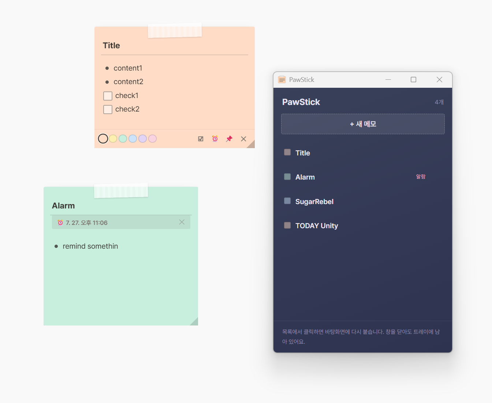

# PawStick

바탕화면에 붙이는 포스트잇 메모. 광고 없음, 추적 없음.

For English, see [README.md](README.md).



---

## 왜 만들었나

바탕화면 메모 프로그램을 찾다가 대부분이 광고를 달고 있다는 걸 알게 됐습니다.
어떤 것은 브라우저 주소창을 읽어 검색어를 수집하고, 크롬에 북마크를 몰래 심기도 했습니다.

메모장은 메모장이면 충분합니다. 그래서 직접 만들었습니다.

- 광고 없음
- 수집하거나 전송하는 데이터 없음
- 계정 필요 없음
- 네트워크 통신 자체가 없음
- 자동 업데이트로 원하지 않은 게 추가되는 일 없음

소스는 이 저장소에 전부 공개되어 있습니다. 직접 확인하실 수 있습니다.

---

## 기능

**바탕화면에 붙습니다.** 메모마다 독립된 창입니다. 마스킹테이프를 끌어 옮기고,
접힌 모서리를 끌어 크기를 조절합니다. 창마다 '항상 위' 고정을 따로 켤 수 있습니다.

**제목줄이 따로 있습니다.** 제목은 자동으로 굵게 나옵니다. `Enter`로 본문으로 넘어갑니다.

**마크다운식 서식.** `- `를 입력하면 불릿, `[] `를 입력하면 체크박스로 바뀝니다.
입력한 기호는 사라지고 실제 서식이 적용됩니다. `Tab`으로 하위 단계로 들여쓰면
불릿 모양도 함께 바뀝니다. 내용이 빈 서식 줄에서 `Backspace`를 누르면 서식이 풀립니다.

**체크리스트가 이어집니다.** 체크 항목 끝에서 `Enter`를 누르면 다음 줄도 체크
항목이 됩니다. 목록이 길어도 빠르게 적을 수 있습니다.

**6가지 색.**

**알람.** 메모마다 시각을 정해두면 윈도우 알림으로 알려줍니다.

**적는 즉시 저장됩니다.** 저장 버튼이 없습니다. 위치, 크기, 색상, 체크 상태까지
모두 기억합니다. 앱을 껐다 켜면 열려 있던 메모가 그 자리에 그대로 돌아옵니다.

**자동 백업.** 시작할 때, 6시간마다, 종료할 때 백업합니다. 폴더는 직접 지정할 수
있고 최근 20개를 보관합니다.

**트레이에 상주합니다.** 창을 모두 닫아도 트레이에 남아 있습니다. 우클릭으로 새 메모,
목록 열기, 백업, 시작 시 실행 설정을 할 수 있습니다.

**한국어와 영어.** 윈도우 언어를 따라갑니다.

---

## 다운로드

[Releases](../../releases)에서 받으세요.

| 파일 | 설명 |
|---|---|
| `PawStick-x.x.x-setup.exe` | 설치판. 시작 메뉴와 바탕화면에 등록됩니다 |
| `PawStick-x.x.x-portable.exe` | 무설치판. 실행하면 바로 씁니다 |

Windows 10 이상, 64비트.

### 처음 실행할 때 경고가 뜹니다

Windows가 "PC를 보호했습니다"라는 파란 화면을 띄울 수 있습니다.
**추가 정보 → 실행**을 누르면 됩니다.

코드 서명 인증서가 없어서 그렇습니다. 개인 개발자용 인증서는 연간 수십만 원이
들어 무료 프로그램에는 붙이지 않았습니다. 백신이 격리하는 경우 예외로 등록해 주세요.

찜찜하시면 소스를 직접 확인하고 빌드하실 수 있습니다. 방법은 아래에 있습니다.

---

## 메모는 어디에 저장되나

```
%APPDATA%\pawstick\memos.json
```

JSON 파일 하나입니다. 열어보면 내용을 읽을 수 있고, 이 파일만 복사하면 백업이
끝납니다. 다른 PC로 옮길 때도 이 파일만 가져가면 됩니다.

프로그램을 제거해도 이 파일은 지워지지 않습니다. 다시 설치하면 메모가 그대로 있습니다.

---

## 직접 빌드하기

Node.js 18 이상이 필요합니다.

```bash
git clone https://github.com/elliezu/pawstick.git
cd pawstick
npm install
npm start          # 개발 모드로 실행
npm run dist       # 설치판·무설치판을 dist 폴더에 빌드
```

---

## 라이선스

[GPL-3.0](LICENSE)

자유롭게 사용하고 수정하고 배포하실 수 있습니다. 다만 수정한 것을 배포할 때는
소스도 함께 공개해야 합니다.

이 조건을 둔 이유가 있습니다. 이 프로그램은 광고 없는 메모장이 없어서 만들었습니다.
누군가 이 코드에 광고를 붙여 몰래 배포하는 일은 막고 싶었습니다.

---

## 만든 곳

[StudioCats](https://studiocats.kr) — 3D Art & Design
